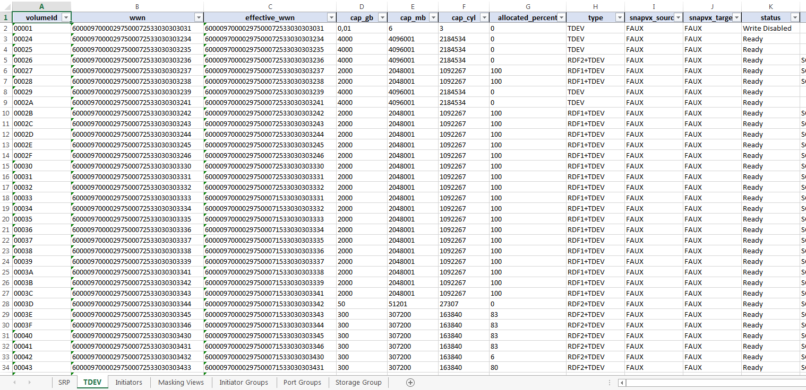

# Vmax-XRay

A tool to provide an inventory of your EMC2 VMAX-3 array.

## Purpose

Provide an inventory of all the configuration of a VMAX-3 array, including :
- SRP details
- List of all the TDEVs
- List of the WWNs logged on the array
- List of the IGs and cascaded IG
- List of masking views
- List of port groups
- List of SG

The inventory file generated by this tool is an excel file. New formats will 
be added as needed.

***At the moment, the only supported array's are VMAX-3 (including AFA models)
with UNISPHERE 8.4.***

FYI: the current version of PyU4V support only VMAX-3 arrays, so the support 
of VMAX-2 arrays is not possible right now. I'll make maybe a custom version 
to change that. There is a lot of VMAX-2 still in the wild after all ! :-) 

## Dependencies 

This tool use several module that you can find in the file requirements.txt.
I use a embedded and modified version of the PyU4V module.

## Usage

```
[jbrt@localhost]$ ./vmax-xray.py --help
usage: vmax-xray.py [-h] [-p PATH] [-d] config

Vmax-XRay - Tool for Inventory a VMAX

positional arguments:
  config                config file

optional arguments:
  -h, --help            show this help message and exit
  -p PATH, --path PATH  path to store the inventory file
  -d, --debug           enable the debug mode

```

## Example

This example :

```
[jbrt@locahost]$ ./vmax-xray.py example.conf
Initializing a Excel workbook (Vmax-000297500071.xlsx)
Beginning of data extraction (Vmax SID:000297500071)
- Extraction of SRPs
- Extraction of TDEVs
- Extraction of initiators
- Extraction of masking views
- Extraction of initiators groups
- Extraction of cascaded initiators groups
- Extraction of port groups
- Extraction of storage groups
End of data extraction (Vmax SID:000297500071)
```

Will produce this Excel file :


## Configuration file

Here is the syntax of the configuration file needed by this tool :

```
[SID_NUMBER]
    address = IP_ADDRESS
    user = username_of_UNISPHERE
    password = password (I hope you're not using the default one 'smc' ;-)
``` 

You can add all the VMAXs you need.

## TODO

There is a lot of work ahead ! This is a first release of that tool. Many
new features will come depending on the needs. Here is some of ideas :

- Adding support of the VMAX-2 arrays
- Adding new inventory format (load data into ElasticSearch, why not ?)
- Eventually, adding support of third parties arrays (like IBM FlashSystem) 
  Maybe with another tool, not specially Vmax-XRay... sounds logic ;-)

Feel free to contribute if you want.
